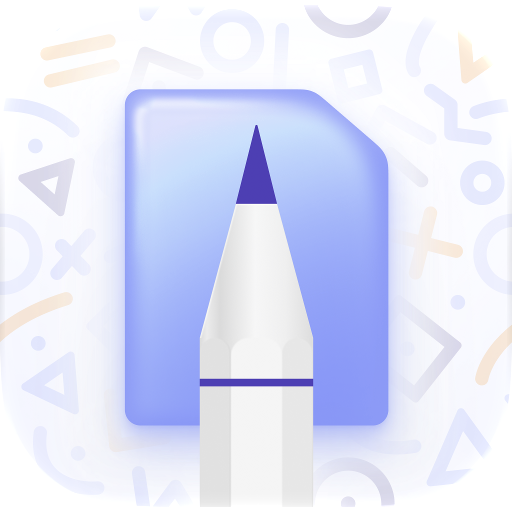

  <h1>Kyo 1.0 Archive </h1>
  
The original Kyo: a place for your timetable, classes, and tasks.

  
   

## Why share this?

This was the original Kyo, and quite a learning experience. It is no longer on the App Store. A lot has changed since I made it, but I still think there is value in letting people see how it worked, learn from it, and try their own ideas.

This is a historical archive. The original implementation and folder names are preserved. Bundle, app-group, and iCloud identifiers are changed for the archive, signing-team values are blank, and old export binaries and logs are excluded. I am not updating it to current standards or maintaining it as another version of Kyo.

## Yes, the code is rough

I know. There are questionable names, commented-out experiments, and more debug prints than anyone needed. I was learning, and it shows.

I have left that code as it was, apart from the identifiers needed to keep the archive separate from the original app. It is not a tidied-up version of how I wish I had written it. Hopefully there is something useful in here, even if some of it is what not to do.

## Where it fits

The archive covers the original 1.0 era, including its later 1.0.x updates.

Kyo 1.0.3 was the last release of the original app. An initial 2.0 rewrite was started afterwards and later abandoned. That unfinished rewrite is not included here.

The current [Kyo Renaissance](https://github.com/Aeastr/Kyo) is a later revival of the app. It is not the abandoned 2.0 attempt.

This snapshot comes from legacy commit `ef3ed674719c865a25a5e3b724f3be601be9b614`, where the main project is set to 1.0.3, build 67. It is the available source checkpoint for that version, rather than a verified match to the exact App Store binary. See the [archive notes](docs/KyoLegacy.docc/Archive/Archive.md) for provenance.

## Explore the source

Open `KyoNeo.xcodeproj` in Xcode. The main app target is `KyoNeo`; the repository also contains its widgets, Watch code, and other companion targets.

The badges reflect the main project's historical deployment settings. The complications extension specifies watchOS 10.2. Dependency versions are recorded in the original `Package.resolved`. Some dependencies or services may have changed or become unavailable since then, so this archive is not a promise of a working build with today's tools.

The original database package and SymbolPicker are included at the revisions pinned by this source snapshot. SymbolPicker’s former repository is unavailable; its exact commit was recovered from the upstream fork network. A stale reference to a missing Desktop StoreKit testing file was removed. The archive uses `com.example.kyoarchive`, with matching app-group and iCloud identifiers. Select your own signing team and configure the archive identifiers for your account before building. These identifiers are separate from the original app; external service configuration still needs your attention.

The original folders and names are left alone so this remains a useful record of the app. New documentation lives in [the DocC catalog](docs/KyoLegacy.docc/KyoLegacy.md).

## Contributing

This archive is for reading and experimenting. I am not accepting feature changes or modernizing the app here. Corrections to the documentation are welcome.

## License

Original Kyo code in this archive, including the database package, is available under [GPLv3](LICENSE), with the attribution term in [source notes](SOURCE-NOTES.md). Distributed derivatives must keep the whole covered work under GPLv3 and provide its corresponding source and required notices. The source notes explain the separate treatment of dependencies and artwork.
